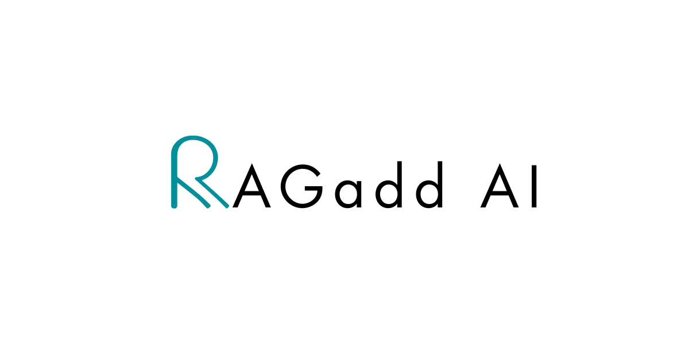

# RAGadd AI - Document Chat Assistant



## 🚀 Overview

**RAGadd AI** is an advanced document chatbot that allows you to upload documents and chat with them using state-of-the-art Retrieval Augmented Generation (RAG) technology. Built with Flask, LangChain, and integrated with OpenRouter's AI models, RAGadd AI transforms your documents into an interactive knowledge base.

### ✨ Key Features

- 📄 **Multi-format Document Support** - PDF, DOCX, TXT, CSV, Excel, PowerPoint, HTML, JSON, Python files and more
- 🤖 **Advanced RAG Pipeline** - Powered by LangChain and FAISS vector database
- 💬 **Intelligent Chat Interface** - Natural conversation with your documents
- 🎨 **Modern UI/UX** - Clean, responsive design with dark/light theme support
- 🔒 **Secure API Integration** - OpenRouter integration for powerful AI models
- 📱 **Mobile Responsive** - Works seamlessly on all devices
- 💾 **Chat Export** - Download your conversations as text files

## 🛠️ Technology Stack

- **Backend**: Flask, Python
- **AI/ML**: LangChain, FAISS, HuggingFace Embeddings, LangGraph
- **Document Processing**: PyPDF, python-docx, unstructured
- **Frontend**: HTML5, CSS3, JavaScript
- **AI Provider**: OpenRouter API (Claude, GPT models)

## 📋 Prerequisites

Before installation, ensure you have:

- Python 3.8 or higher
- pip (Python package installer)
- An OpenRouter API key ([Get one here](https://openrouter.ai/))

## ⚡ Quick Installation

### 1. Clone the Repository

```bash
git clone https://github.com/HiMahendraBeniwal/RAGadd-app.git
cd RAGadd-app
```

### 2. Create Virtual Environment

```bash
python -m venv venv
```

### 3. Activate Virtual Environment

**Windows:**
```bash
venv\Scripts\activate
```

**macOS/Linux:**
```bash
source venv/bin/activate
```

### 4. Install Dependencies

```bash
pip install -r requirements.txt
```

### 5. Run the Application

```bash
python app.py
```

### 6. Access the Application

Open your web browser and navigate to:
```
http://localhost:5000
```

## 🔧 Configuration

### Setting up OpenRouter API Key

1. Visit [OpenRouter](https://openrouter.ai/) and create an account
2. Generate your API key from the dashboard
3. In the RAGadd AI interface, enter your API key in the designated field
4. Click "Activate API Key" to verify and enable the service

## 📚 How to Use

### Step 1: Activate API Key
- Enter your OpenRouter API key in the app
- Click the "Activate API Key" button
- Wait for confirmation of successful activation

### Step 2: Upload Documents
- Click the upload area or drag & drop your files
- Supported formats: PDF, DOCX, TXT, CSV, XLSX, PPTX, HTML, JSON, PY
- Multiple files can be uploaded simultaneously
- Click "Process Documents" to analyze your files

### Step 3: Start Chatting
- Once documents are processed, the chat interface becomes active
- Type your questions about the uploaded documents
- Get instant, contextual answers powered by AI
- Use the download button to save your conversation

### Step 4: Advanced Features
- Switch between light and dark themes using the theme selector
- Download chat history as a text file
- Upload new documents anytime to expand your knowledge base

## 📁 Supported File Formats

| Format | Extension | Description |
|--------|-----------|-------------|
| PDF | `.pdf` | Portable Document Format |
| Word | `.docx`, `.doc` | Microsoft Word documents |
| Text | `.txt` | Plain text files |
| Spreadsheet | `.xlsx`, `.xls`, `.csv` | Excel and CSV files |
| Presentation | `.pptx`, `.ppt` | PowerPoint presentations |
| Web | `.html`, `.htm` | HTML documents |
| Code | `.py`, `.js`, `.css` | Programming files |
| Data | `.json` | JSON data files |

## 🚀 Deployment

### Local Development
```bash
python app.py
```

### Production Deployment

For production deployment, consider using:

**Using Waitress (Recommended):**
```bash
pip install waitress
waitress-serve --host=0.0.0.0 --port=5000 app:app
```

**Using Gunicorn (Linux/Mac):**
```bash
pip install gunicorn
gunicorn --bind 0.0.0.0:5000 app:app
```

## 🔒 Security Notes

- API keys are stored securely in session storage
- Uploaded documents are processed temporarily and cleaned up automatically
- No documents are permanently stored on the server
- All communication uses secure HTTPS protocols

## 🛠️ Troubleshooting

### Common Issues

**API Key Not Working:**
- Verify your OpenRouter API key is correct
- Check your OpenRouter account has sufficient credits
- Ensure stable internet connection

**Document Upload Fails:**
- Check file format is supported
- Ensure file size is reasonable (< 50MB per file)
- Try uploading fewer files at once

**Chat Not Responding:**
- Verify API key is activated
- Check that documents were successfully processed
- Refresh the page and try again

### Error Messages

| Error | Solution |
|-------|----------|
| "API key not activated" | Enter and activate your OpenRouter API key |
| "Session expired" | Re-upload your documents |
| "No valid content found" | Ensure uploaded files contain readable text |

## 🤝 Contributing

I welcome contributions! Please follow these steps:

1. Fork the repository
2. Create a feature branch (`git checkout -b feature/AmazingFeature`)
3. Commit your changes (`git commit -m 'Add some AmazingFeature'`)
4. Push to the branch (`git push origin feature/AmazingFeature`)
5. Open a Pull Request

## 📄 License

This project is licensed under the MIT License - see the [LICENSE](LICENSE) file for details.

## 👨‍💻 Developer

**Mahendra Beniwal**
- GitHub: [@HiMahendraBeniwal](https://github.com/HiMahendraBeniwal)

## 🙏 Acknowledgments

- [LangChain](https://langchain.com/) for the RAG framework
- [OpenRouter](https://openrouter.ai/) for AI model access
- [FAISS](https://faiss.ai/) for vector similarity search
- [HuggingFace](https://huggingface.co/) for embeddings

## ⭐ Star History

If you find this project helpful, please consider giving it a star!

[](https://star-history.com/#HiMahendraBeniwal/RAGadd-app&Date)

---

<div align="center">
  
  <br>
  <strong>RAGadd AI - Transform Your Documents into Interactive Knowledge</strong>
  <br>
  Made with ❤️ by Mahendra Beniwal
</div>
